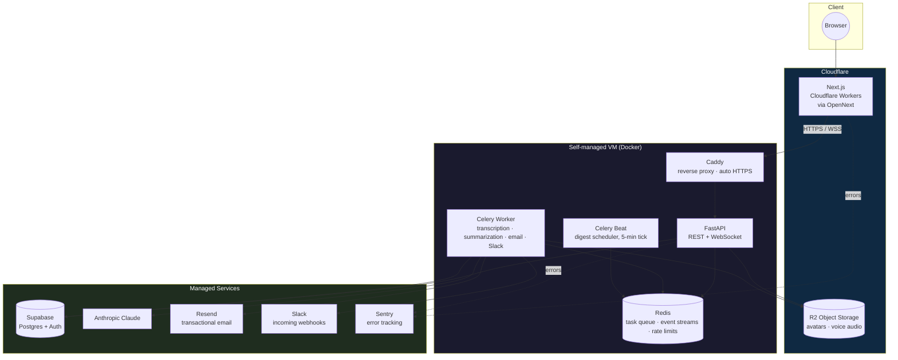
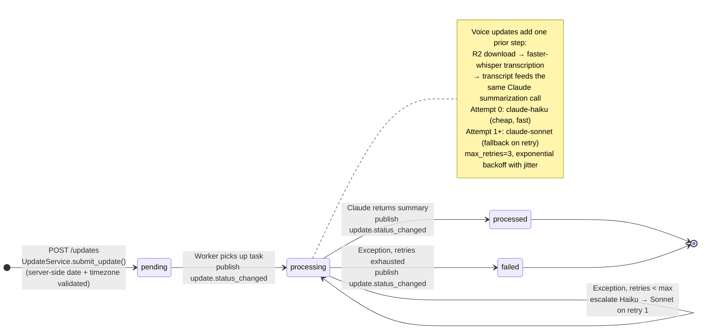
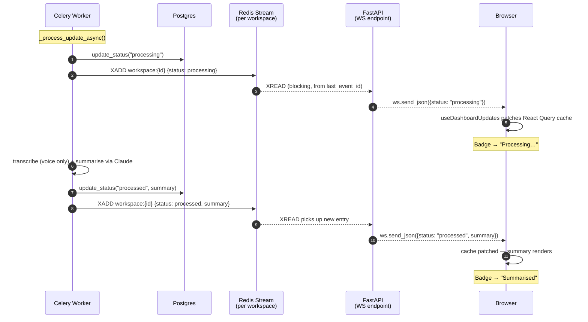
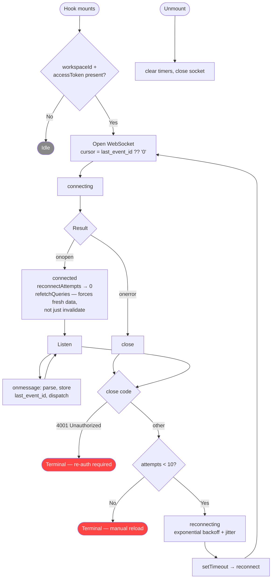
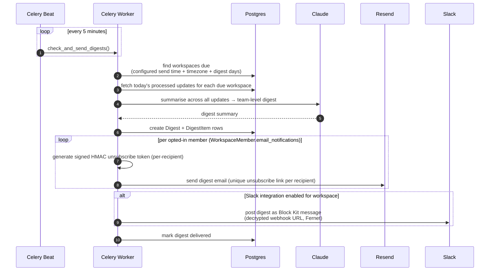
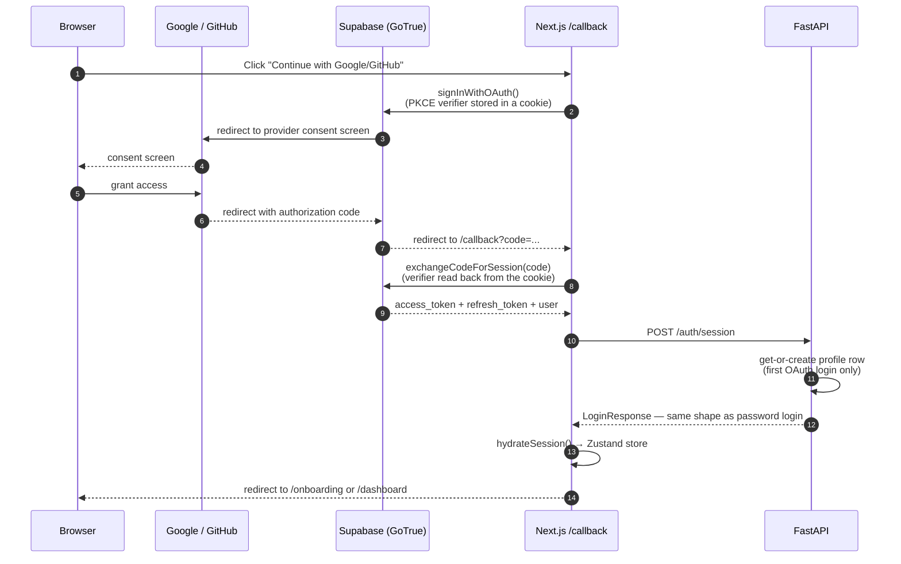
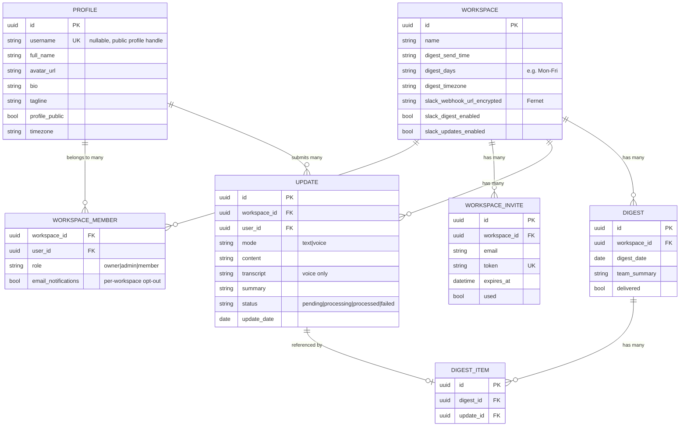

# SoarUp — Architecture

This is the current source of truth for how SoarUp is built and deployed.
It supersedes `specs/Scaffolding/01-architecture.md` and
`specs/architecture/milestone-3-flows.md`, both of which describe the
system as originally scoped rather than as it now runs in production —
most notably, the real-time layer has since moved from Redis pub/sub to
Redis Streams, and several reliability fixes have landed on top of that.

All diagrams below are Mermaid and render natively on GitHub — no image
export needed.

---

## 1. System & Deployment Topology

**Why this shape, not a fully serverless one:** the backend runs three
coordinated long-lived processes (API, worker, beat) that all need to
stay up continuously and share state via Redis — a scale-to-zero edge
runtime can't host a persistent scheduler (`beat`'s 5-minute digest tick
needs a process that never goes cold). The frontend has no such
constraint, so it runs on Cloudflare's edge for latency and cost.
Everything stateful (Postgres, object storage, email, AI) is a managed
service — only compute for the three coordinated processes is
self-hosted.

**Environments:** `feature/*` branches deploy nowhere (local only).
`develop` auto-deploys to staging. `main` is the production target,
promoted manually from `develop` once staging is verified. Each
environment has its own Supabase project, Redis instance, R2 bucket, and
Sentry project — no shared state between staging and production.

---

## 2. Update Processing Pipeline

Every submitted update — text or voice — moves through the same state
machine. The Celery worker owns every transition after the initial
`pending` state.

Both the submission endpoint and the Celery task are rate-limited /
resilient independently: submission is protected by GCRA rate limiting
(per authenticated user, not per IP — this is a team tool, and IP-based
limits would let one teammate's burst throttle a shared office
connection); the Celery task uses `NullPool` on its database engine
specifically because each task invocation runs under a fresh `asyncio`
event loop (`asyncio.run()`), and a normal connection pool's cached
connections don't survive across event loop boundaries.

---

## 3. Real-Time Event Delivery (Redis Streams, not pub/sub)

This is the layer that pushes "Processing…" → "Summarised" status
changes into the browser without a page refresh. It's built on **Redis
Streams**, not plain pub/sub — the distinction matters: pub/sub is
fire-and-forget (a message published while nobody is subscribed is gone
forever), while a Stream is a durable, replayable log. A client that
reconnects after a network blip can ask "give me everything since event
ID X" and receive exactly what it missed.

### Connection lifecycle (browser side)

**Two reliability fixes worth calling out**, since they were real bugs
found during hardening, not part of the original design:

- **Cursor defaults to `'0'` (full history), not `'$'` (new entries
  only).** A first-time connection using `'$'` could miss an event
  published in the gap between JWT validation completing and the
  `XREAD` actually starting — a real, observed race, not a theoretical
  one.
- **Reconnect uses `refetchQueries`, not `invalidateQueries`.**
  `invalidateQueries` only marks data stale; if nothing is actively
  re-rendering at that instant, the fetch doesn't fire until something
  else triggers it. `refetchQueries` forces the fetch immediately on
  reconnect, closing that gap.

---

## 4. Digest Scheduling Pipeline

A separate async pipeline from the per-update processing above — this
one runs on a schedule rather than in response to a user action, and
fans out to two delivery channels.

Recipient filtering is **per-workspace**, not a single global opt-out —
a user can unsubscribe from one team's digests without affecting others
they belong to. The unsubscribe token is HMAC-signed (tamper-evident,
not reversible — deliberately a different primitive from the Fernet
encryption used for Slack webhook URLs, which _do_ need to be
decrypted back to a usable URL).

---

## 5. OAuth Authentication Flow (PKCE)

Google and GitHub sign-in run alongside the original email/password
flow — same `profiles` table, same onboarding step, same
`LoginResponse` shape returned to the frontend. Supabase's GoTrue
handles the actual provider handshake; the app's job is limited to
completing the PKCE code exchange client-side and syncing the
resulting session into the app's Zustand store and the app's own
profile row.

**One reliability fix worth calling out**, found during staging QA
rather than part of the original design:

- **A duplicate `/callback?code=...` navigation can consume the PKCE
  code twice.** A second navigation to the same callback URL —
  observed in practice with Chrome's speculative prerendering —
  re-attempts an already-redeemed code, and GoTrue correctly rejects it
  (`AuthPKCECodeVerifierMissingError` — the verifier cookie is deleted
  after its first successful use). Rather than surface that as a hard
  failure, the callback page checks for an already-established session
  via `supabase.auth.getSession()` before giving up: if an earlier,
  successful exchange already produced a session, the second call
  falls back to it instead of showing the user a spurious error.

---

## 6. Data Model

Core entities and their relationships. Field lists are illustrative, not
exhaustive — see `apps/api/app/models/` for the full SQLAlchemy models.

Notable constraints: one `Update` per `(workspace_id, user_id,
update_date)` — enforced at the database level, not just in application
logic. `username` is unique but nullable — most users never set one
unless they opt into a public profile. `Profile` rows are created in
two ways: a provisional row on any first-time sign-in (password, OAuth,
or invite), fully populated once onboarding completes.

---

## 7. Security & Reliability Notes

A few decisions worth documenting explicitly rather than leaving
implicit in code:

- **Rate limiting (GCRA)** is keyed per authenticated user rather than
  per IP, because SoarUp is a team tool and teammates legitimately share
  office/VPN IPs — IP-keying would let one person's activity throttle
  an entire team.
- **Slack webhook URLs are encrypted at rest** (Fernet, dedicated
  encryption key, separate from other application secrets) since a
  leaked webhook URL would let an attacker post into a customer's Slack
  channel.
- **Unsubscribe tokens are HMAC-signed, not encrypted** — the token only
  needs to be tamper-evident (can't be forged), not reversible, so a
  simpler and more appropriate primitive is used than for the Slack
  case above.
- **JWT issuer validation** checks Supabase's actual `iss` claim
  (`{supabase_url}/auth/v1`), not just the bare project URL — a subtle
  mismatch that silently breaks auth if missed.
- **OAuth `user_metadata` shape differs by provider** — Google exposes
  the display name as `full_name`, GitHub exposes it as `name`. Profile
  sync checks both, so a provider-specific quirk doesn't silently drop
  the user's display name on first login.
- **PII collection is explicitly disabled in Sentry** on both frontend
  and backend — error tracking without incidentally warehousing user
  data.

---

## Known limitations / active tradeoffs

Tracked as labeled GitHub issues rather than left implicit:
`tech-debt` for deferred engineering work, `security` for anything with
a security dimension, `post-m9` for backlog items scoped after the
initial nine-milestone feature set. See the
[issues page](https://github.com/shankssc/soarup/issues) for the current,
authoritative list — it changes more often than this document should.

Scaling considerations specific to the OAuth milestone are tracked
separately in
[`docs/scaling/oauth-milestone-scaling-challenges.md`](./scaling/oauth-milestone-scaling-challenges.md).
