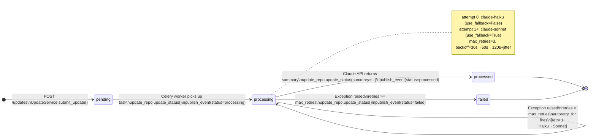
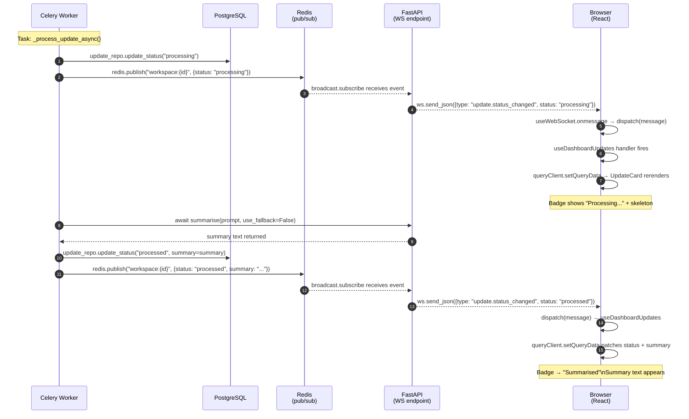
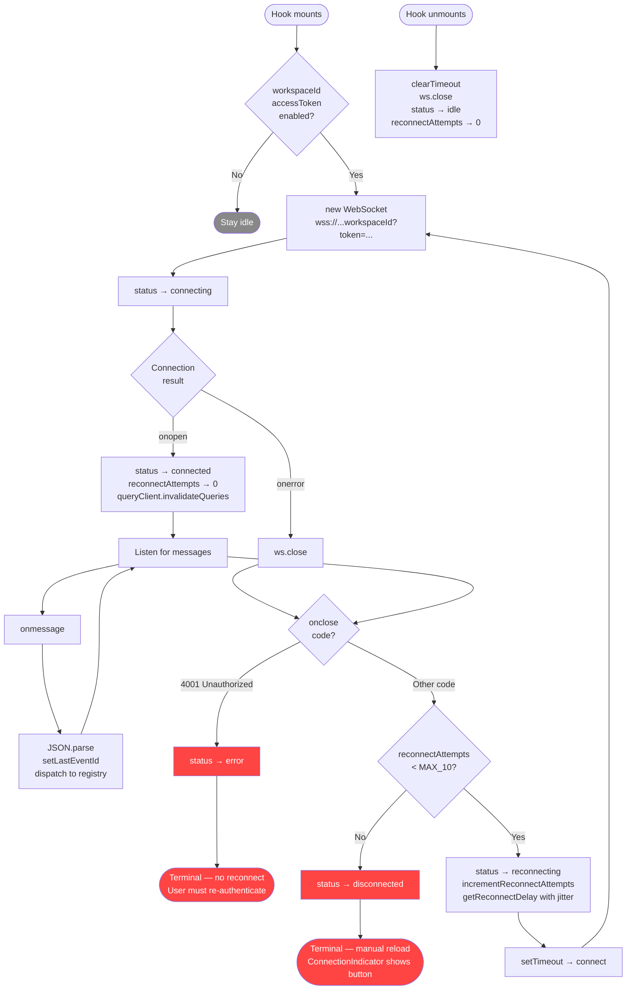

# SoarUp — Milestone 3: Architecture Flow Diagrams

# Path: specs/architecture/milestone-3-flows.md

# Last updated: Milestone 3

---

## Diagram 1: Celery Pipeline State Machine

The update processing pipeline transitions an `Update` row through four
statuses. The Celery task owns all transitions after the initial `pending`
state set by `UpdateService.submit_update()`. Each transition writes to the
DB and publishes a WebSocket event. Retries escalate from Haiku to Sonnet
on the first retry, then continue with Sonnet until max retries are exhausted.

---

## Diagram 2: WebSocket Pub/Sub Data Flow

This sequence diagram traces the full path of a single `update.status_changed`
event from the Celery worker publishing it to the `UpdateCard` rerendering
in the browser. Three separate processes are involved: the Celery worker
(separate process), the FastAPI API server (handles both HTTP and WebSocket),
and the Next.js frontend (browser tab).

The critical design point is that the Celery worker never talks to the
frontend directly — Redis pub/sub is the decoupling layer. The API server
subscribes to the Redis channel via `broadcaster` and forwards events to
all connected WebSocket clients in that workspace. The frontend's
`useDashboardUpdates` hook patches the React Query cache surgically, so
only the affected `UpdateCard` rerenders.

---

## Diagram 3: Frontend WebSocket Connection Lifecycle

This flowchart shows the complete lifecycle of the `useWebSocket` hook from
mount to unmount. The two terminal states are `error` (4001 — unauthorized,
no recovery) and `disconnected` (max retries exhausted — requires manual
reload). All other close events trigger exponential backoff reconnection.

The `onopen` handler is the only place where React Query cache invalidation
fires — this catches any `update.status_changed` events that were published
while the connection was down, since Redis pub/sub has no persistence.

---

## Reading These Diagrams Together

The three diagrams represent three different levels of the same system:

**Diagram 1** — what happens to data (Update row status transitions in the DB).

**Diagram 2** — how that data change propagates across processes (Worker → Redis → API → Browser).

**Diagram 3** — how the browser maintains the connection that makes Diagram 2 possible.

A useful mental model: Diagram 1 is the **what**, Diagram 2 is the **how across processes**, and Diagram 3 is the **how within the browser**.

---

## Retry Timing Reference

The exponential backoff in `useWebSocket` uses full jitter. Approximate
delays per attempt (vary due to jitter):

| Attempt | Base delay | With jitter (50–100%) |
| ------- | ---------- | --------------------- |
| 1       | 1s         | 0.5–1s                |
| 2       | 2s         | 1–2s                  |
| 3       | 4s         | 2–4s                  |
| 4       | 8s         | 4–8s                  |
| 5       | 16s        | 8–16s                 |
| 6+      | 30s (cap)  | 15–30s                |

Max 10 attempts. Total wall time to exhaustion: approximately 2–4 minutes
depending on jitter. After exhaustion, `ConnectionIndicator` shows the
manual reconnect button which triggers `window.location.reload()`.

The Celery task uses a different backoff — server-side, fixed base of 30s
with Celery's built-in doubling: 30s → 60s → 120s (capped). Max 3 retries.
